###### VLOOK™ for Obsidian<br>语法示例<br>*最新版本`V0.1.0`*<br>**VLOOK**

# 文本与标签

这是 **加粗文本**_~Rd~_，这是 ==高亮文本==_~BuAq~_，这是 <u>下划线</u>_~Pu~_。

_~Gd~_ 这一整个段落使用金色。

单级标签：*`待处理`*_~Rd~_ *`进行中`*_~Bu!~_ *`渐变标签`*_~T1T2~_ *`默认`*

多级标签：*客户等级`VIP`*_~BnGd~_ *版本`V2.3`beta*_~BuOg~_ *变量`{{name}}`*

刮刮卡：答案是 *点击查看**42***，再来一个 ***默认提示***_~Bu~_。

注音：道_^dào^_生一，一生二，二生_^shēng^_三。代码式注音：`{万物}(wàn wù)`

化学式 H~2~O，平方 x^2^。

进度条：**==35==** **==80==** **==120==** **==-20==**

面包屑：请点击 *==文件 > 导出 > HTML==* 完成导出。

按钮：[<kbd>访问 VLOOK for Obsidian</kbd>](https://github.com/ignorance-shiyao/VLOOK-for-Obsidian) *[<kbd>次要按钮</kbd>](https://github.com)* **[<kbd>超级按钮</kbd>](https://github.com)**

# 引用块

> **这是引用块的小标题**
>
> 引用块正文内容。
>
> _~Rd!~_

> ==左侧风格小标题==
>
> 正文

> ###### 什么是三段论？
>
> 三段论推理是演绎推理中的一种简单推理判断。
>
> _~Gn~_

> [!NOTE]
> GitHub Style Alert：Note

> [!WARNING]
> 注意潜在风险

## 引用块分栏

---
---

> **分栏 1**
>
> 第一栏内容
>
> _~Rd~_

> **分栏 2**
>
> 第二栏内容更长一些，测试等高处理。第二栏内容更长一些，测试等高处理。
>
> _~Gn~_

> **分栏 3**
>
> 第三栏
>
> _~Bu!~_

## 列表分栏

---

- 列表 1
  - 列表项 1-1
- 列表 2
  - 列表项 2-1
- 列表 3
- 列表 4

# 表格

*==单元格合并示例_第二题注：表格下方_==*

| 列 A | 列 B | 列 C | 列 D |
| ---- | ---- | ---- | ---- |
| 纵向合并 ×2 | 横向合并 ×3 | == | == |
| : | 普通 | 普通 | 普通 |
| 普通 | 普通 | 着色单元格_~Rd!~_ | 普通 |

*==列格式示例==*

| **名称** | *斜体* | []完成 | 金额 | ~~不发布~~ |
| -------- | ------ | ------ | ---: | ---------- |
| A | 内容 | Y | 12345.67 | x |
| B | 内容 | ? | -2345 | x |
| C | 内容 |  | 88.5% | x |
| D | 内容 | N 说明 | ¥ 3456.78 | x |

*==行分组折叠==*

| 生物分类 | 说明 |
| -------- | ---- |
| 动物 | |
| > 脊椎动物 | |
| >> 哺乳动物 | 人类 |
| >> 鸟类 | 鸡 |
| > 无脊椎动物 | |
| 植物 | |
| > 被子植物 | 番茄 |

# 图片


图标混排：这是  VLOOK 图标，2 倍  图标。


# 页签组

_^tab^_

*==表格页签==*

| A | B |
| - | - |
| 1 | 2 |

```js
// 代码页签
console.log("Hello VLOOK");
```

> **引用块页签**
>
> 引用块内容

# 代码与公式

*==快速排序_语言：C++_==*

```cpp
void quickSort(int arr[], int left, int right) {
  int i = left, j = right;
}
```

*==勾股定理==*

$$
a^2 + b^2 = c^2
$$

# 任务

任务整体进度：**==?==**

- [x] 调查目标客户
- [x] 研究竞争对手
- [ ] 收集市场数据
- [ ] 分析市场趋势

## ~~这一章不发布~~

导出 HTML 时会被移除，编辑时弱化显示。

<!-- vlook-public-charts:start -->
# 原版公开图表合集

原版32例集中在此测试，不再拆成32篇笔记。

## 01 流程图

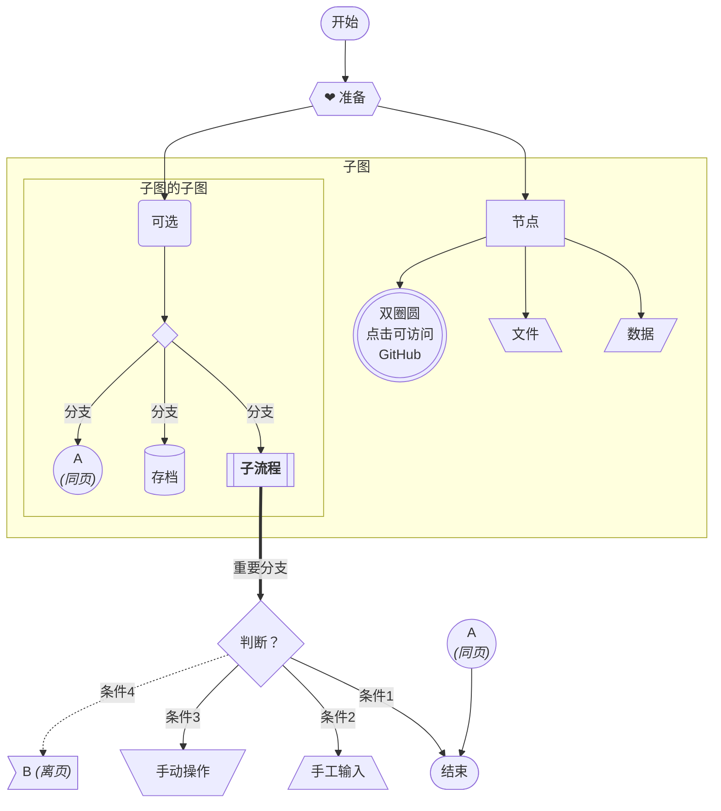
```mermaid
flowchart TB
%% 图的方向说明
%% LR：从左到图，RL：从右到左，TB：从上到下，BT：从下到上

%% 连续连接
START([开始])
START --> pre1{{"❤ 准备"}} --> node2[节点]
pre1 --> node1(可选)

subgraph 子图
  subgraph 子图的子图
    %% 一对多
    node1 --> join1{ }
    join1 --> |分支|groud1[["`**子流程**`"]] & database[(存档)] & inpage1(("`A<br>_(同页)_`"))
    %% click clickable "#Mermaid 的状态机图"
  end
node2 --> data1[/数据/]
node2 --> data2[\文件\]
node2 --> data3(((双圈圆<br>点击可访问<br>GitHub)))
click data3 "https://www.github.com" _blank
end

%% this is a comment

groud1 ==> |重要分支|cond1{"判断？"}
cond1 --> |条件1|END
cond1 --> |条件2|B[/手工输入\]
cond1 --> |条件3|B2[\手动操作/]
cond1 -.-> |条件4|outpage2>"`B _(离页)_`"]

inpage2(("`A<br>_(同页)_`")) --> END
END([结束])
```

## 02 流程图

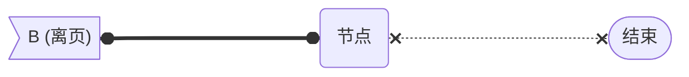
```mermaid
flowchart LR
outpage2>"B (离页)"] o=====o node2(节点) x-....-x END([结束])
```

## 03 分角色流程图

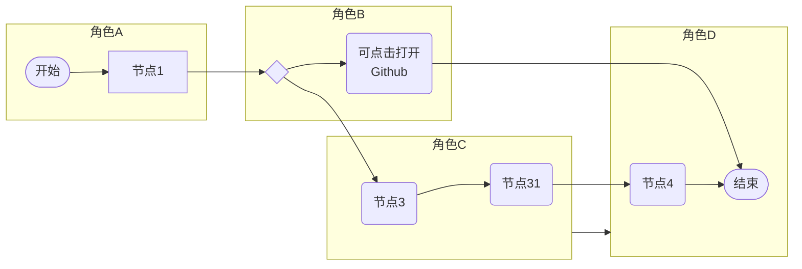
```mermaid
flowchart LR
%% 图的方向说明
%% LR：从左到图，RL：从右到左，TB：从上到下，BT：从下到上

%% 角色A 相关的流程节点
subgraph 角色A
  START([开始]) --> node1[节点1]
end

%% 角色B 相关的流程节点
subgraph 角色B
  node1 --> join1{ } --> node2("可点击打开<br>Github")
  click node2 "https://www.github.com" _blank
end
node2 --> END

%% 角色C 相关的流程节点
subgraph 角色C
    direction BT
  join1 --> node3(节点3) --> node31(节点31)
end

%% 角色D 相关的流程节点
subgraph 角色D
  node31 --> node4(节点4) --> END
end

角色C --> 角色D

END([结束])
```

## 04 顺序图

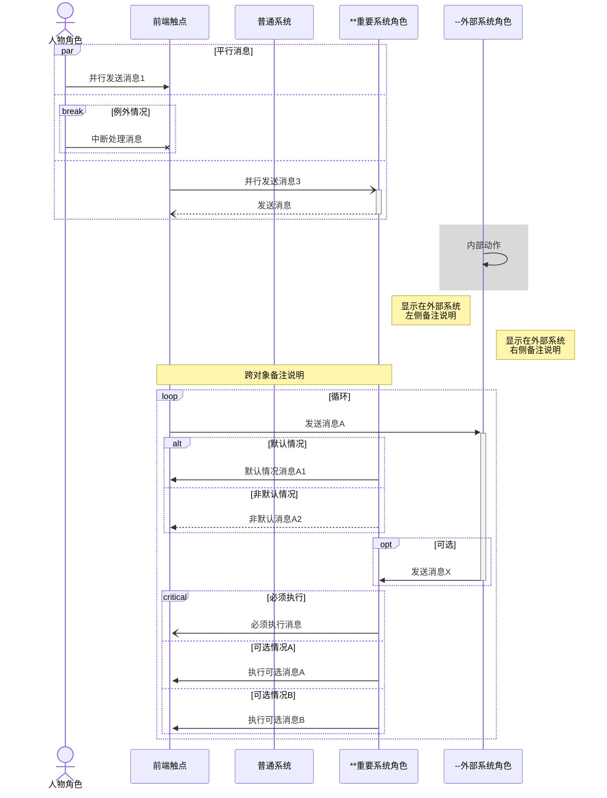
```mermaid
sequenceDiagram
%% 设置显示消息的自动编号

actor User as 人物角色
participant Client as 前端触点
participant MP as 普通系统
participant Server as **重要系统角色
participant Extend as --外部系统角色

par 平行消息
    User ->> Client: 并行发送消息1
and
  break 例外情况
    User -x Client: 中断处理消息
  end
and
  Client -)+ Server: 并行发送消息3
  Server --)- Client: 发送消息
end

%% 设置区域高亮
rect rgba(128, 128, 128, 0.3)
    Extend ->> Extend: 内部动作
end

Note left of Extend: 显示在外部系统<br>左侧备注说明
Note right of Extend: 显示在外部系统<br>右侧备注说明
Note over Client,Server: 跨对象备注说明
loop 循环
    Client ->>+ Extend: 发送消息A
    alt 默认情况
        Server ->> Client: 默认情况消息A1
    else 非默认情况
        Server -->> Client: 非默认消息A2
    end

    opt 可选
        Extend ->>- Server: 发送消息X
    end

    critical 必须执行
    Server -)+ Client: 必须执行消息
  option 可选情况A
    Server ->> Client: 执行可选消息A
  option 可选情况B
    Server ->> Client: 执行可选消息B
  end
end
```

## 05 流程图扩展的状态机图

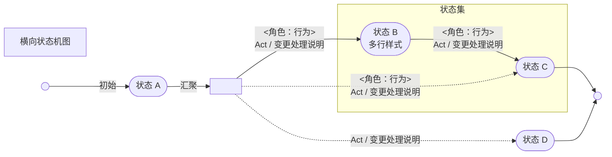
```mermaid
flowchart LR
横向状态机图
%% 图的方向说明
%% LR：从左到图，RL：从右到左，TB：从上到下，BT：从下到上

%% 正常情况
INIT(( )) -->	|初始|A([状态 A])
%% joinv 表示汇聚为竖向样式，join 表示汇聚为横向样式
A --> |汇聚|joinv1[ ]
joinv1 --> |"<角色：行为>"<br>Act / 变更处理说明|B([状态 B<br>多行样式])
subgraph 状态集
    B --> |"<角色：行为>"<br>Act / 变更处理说明|C([状态 C])
end
C --> FINAL

%% 异常情况
joinv1 -.-> |"<角色：行为>"<br>Act / 变更处理说明|C
joinv1 -.-> |Act / 变更处理说明|D([状态 D])
D --> FINAL
FINAL(( ))
```

## 06 流程图扩展的状态机图

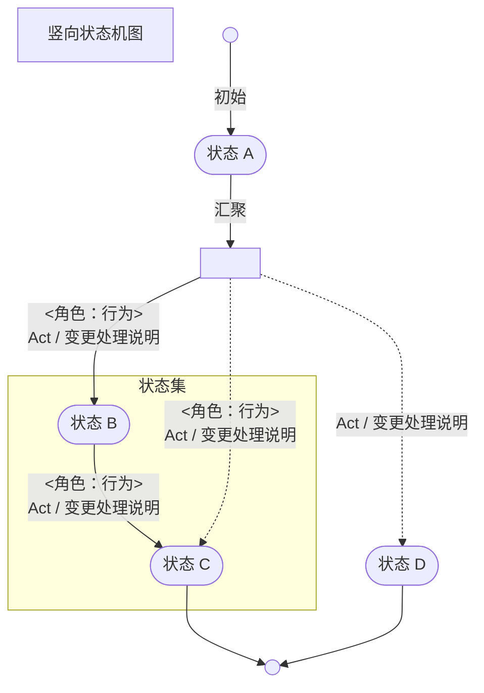
```mermaid
flowchart TB
竖向状态机图
%% 图的方向说明
%% LR：从左到图，RL：从右到左，TB：从上到下，BT：从下到上

%% 正常情况
INIT(( )) -->	|初始|A([状态 A])
%% joinv 表示汇聚为竖向样式，join 表示汇聚为横向样式
A --> |汇聚|join1[ ]
join1 --> |"<角色：行为>"<br>Act / 变更处理说明|B([状态 B])
subgraph 状态集
    B --> |"<角色：行为>"<br>Act / 变更处理说明|C([状态 C])
end
C --> FINAL

%% 异常情况
join1 -.-> |"<角色：行为>"<br>Act / 变更处理说明|C
join1 -.-> |Act / 变更处理说明|D([状态 D])
D --> FINAL
FINAL(( ))
```

## 07 标准状态机图

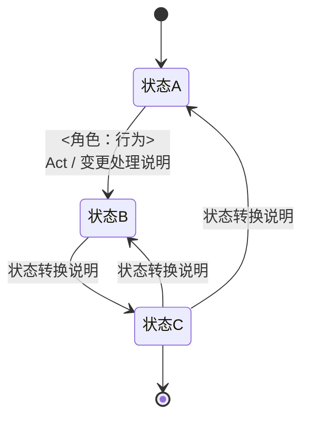
```mermaid
stateDiagram
[*] --> 状态A
状态A --> 状态B : <角色：行为><br>Act / 变更处理说明
状态B --> 状态C : 状态转换说明
状态C --> 状态B : 状态转换说明
状态C --> 状态A : 状态转换说明
状态C --> [*]
```

## 08 标准状态机图

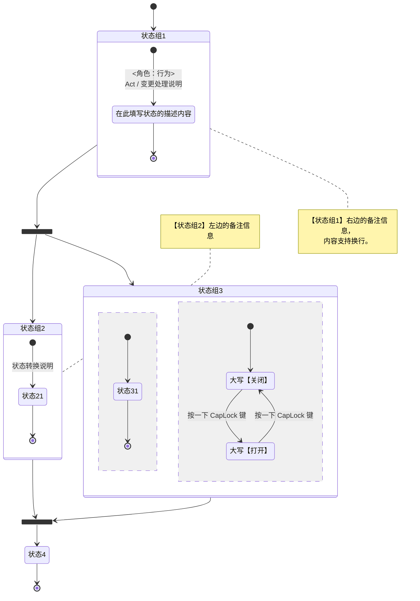
```mermaid
stateDiagram
state fork_state <<fork>>

[*] --> 状态组1
状态组1 --> fork_state
fork_state --> 状态组2
fork_state --> 状态组3

note right of 状态组1
    【状态组1】右边的备注信息，
    内容支持换行。
end note
state 状态组1 {
    状态11 : 在此填写状态的描述内容
    [*] --> 状态11 : <角色：行为><br>Act / 变更处理说明
    状态11 --> [*]
}

note left of 状态组2 : 【状态组2】左边的备注信息
state 状态组2 {
    [*] --> 状态21: 状态转换说明
    状态21 --> [*]
}

%% 可以编写注释（以两个英文百分号开头)
state 状态组3 {
    [*] --> 状态31
    状态31 --> [*]
    --
    [*] --> 大写【关闭】
    大写【关闭】 --> 大写【打开】 : 按一下 CapLock 键
    大写【打开】 --> 大写【关闭】 : 按一下 CapLock 键
}

state join_state <<join>>

状态组2 --> join_state
状态组3 --> join_state
join_state --> 状态4
状态4 --> [*]
```

## 09 类图

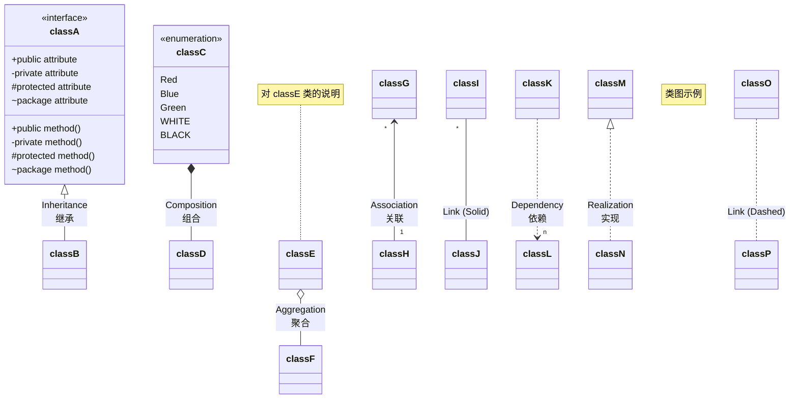
```mermaid
classDiagram
note "类图示例"

classA <|-- classB : Inheritance<br>继承
classC *-- classD : Composition<br>组合
classE o-- classF : Aggregation<br>聚合
classG "*" <-- "1" classH : Association<br>关联
classI "*" -- classJ : Link (Solid)
classK ..> "n" classL : Dependency<br>依赖
classM <|.. classN : Realization<br>实现
classO .. classP : Link (Dashed)

note for classE "对 classE 类的说明"

class classA~Class~{
    <<interface>>
    +public attribute
    -private attribute
    #protected attribute
    ~package attribute
    +public method()
    -private method()
    #protected method()
    ~package method()
}

class classC{
    <<enumeration>>
    Red
    Blue
    Green
    WHITE
    BLACK
}
```

## 10 类图

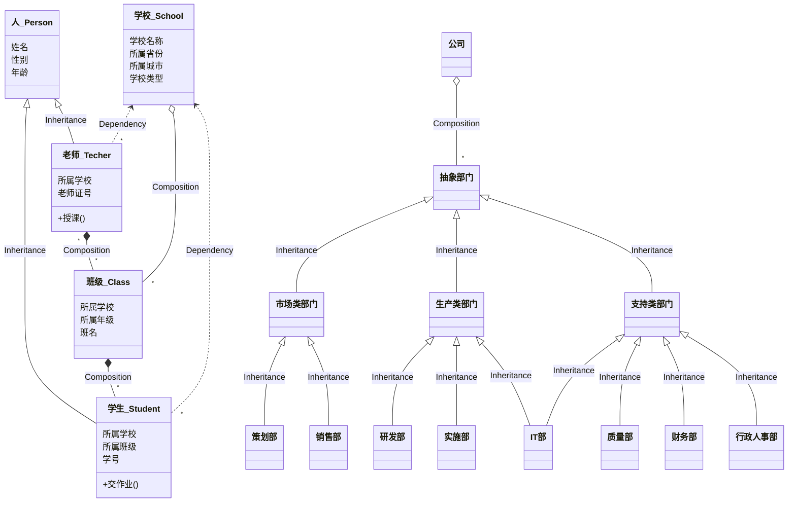
```mermaid
classDiagram

人_Person <|-- 学生_Student : Inheritance
人_Person <|-- 老师_Techer : Inheritance
老师_Techer "*" *-- "*" 班级_Class : Composition
班级_Class *-- "*" 学生_Student : Composition
学校_School <.. "*" 老师_Techer : Dependency
学校_School o-- "*" 班级_Class : Composition
学校_School <.. "*" 学生_Student : Dependency

class 人_Person {
  姓名
  性别
  年龄
}
class 学校_School {
  学校名称
  所属省份
  所属城市
  学校类型
}
class 学生_Student {
  所属学校
  所属班级
  学号
  +交作业()
}
class 老师_Techer {
  所属学校
  老师证号
  +授课()
}
class 班级_Class {
  所属学校
  所属年级
  班名
}

公司 o-- "*" 抽象部门 : Composition
抽象部门 <|-- 市场类部门 : Inheritance
市场类部门 <|-- 策划部 : Inheritance
市场类部门 <|-- 销售部 : Inheritance
抽象部门 <|-- 生产类部门 : Inheritance
生产类部门 <|-- 研发部 : Inheritance
生产类部门 <|-- 实施部 : Inheritance
生产类部门 <|-- IT部 : Inheritance
抽象部门 <|-- 支持类部门 : Inheritance
支持类部门 <|-- 质量部 : Inheritance
支持类部门 <|-- 财务部 : Inheritance
支持类部门 <|-- 行政人事部 : Inheritance
支持类部门 <|-- IT部 : Inheritance
```

## 11 实体关系图

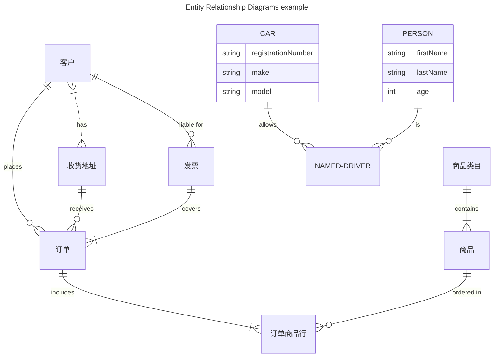
```mermaid
---
title: Entity Relationship Diagrams example
---
erDiagram
    CUSTOMER["客户"]
    ORDER["订单"]
    DELIVERY-ADDRESS["收货地址"]
    INVOICE["发票"]
    DELIVERY-ADDRESS["收货地址"]
    PRODUCT-CATEGORY["商品类目"]
    PRODUCT["商品"]
    ORDER-ITEM["订单商品行"]

    CUSTOMER }|..|{ DELIVERY-ADDRESS : has
    CUSTOMER ||--o{ ORDER : places
    CUSTOMER ||--o{ INVOICE : "liable for"
    DELIVERY-ADDRESS ||--o{ ORDER : receives
    INVOICE ||--|{ ORDER : covers
    ORDER ||--|{ ORDER-ITEM : includes
    PRODUCT-CATEGORY ||--|{ PRODUCT : contains
    PRODUCT ||--o{ ORDER-ITEM : "ordered in"

    CAR ||--o{ NAMED-DRIVER : allows
    CAR {
        string registrationNumber
        string make
        string model
    }
    PERSON ||--o{ NAMED-DRIVER : is
    PERSON {
        string firstName
        string lastName
        int age
    }
```

## 12 方块图

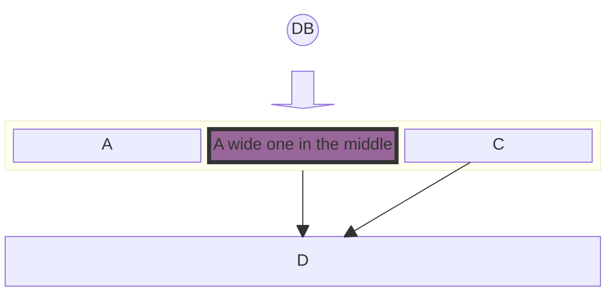
```mermaid
block
columns 1
  db(("DB"))
  blockArrowId6<["&nbsp;&nbsp;&nbsp;"]>(down)
  block:ID
    A
    B["A wide one in the middle"]
    C
  end
  space
  D
  ID --> D
  C --> D
  style B fill:#969,stroke:#333,stroke-width:4px

```

## 13 四象限图

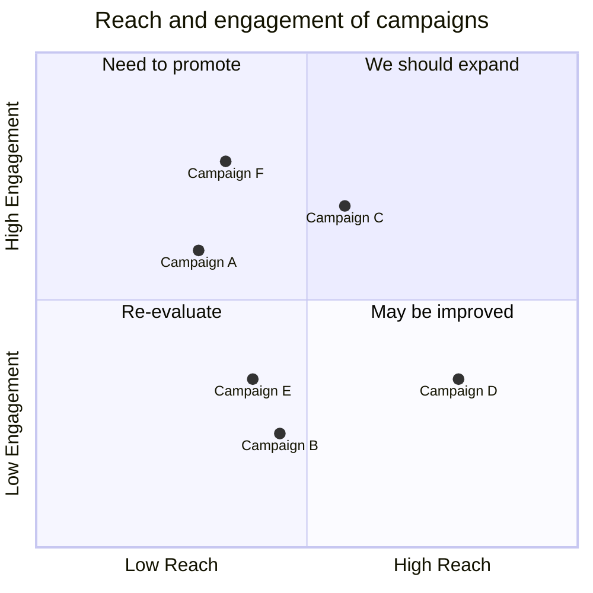
```mermaid
quadrantChart
    title Reach and engagement of campaigns
    x-axis Low Reach --> High Reach
    y-axis Low Engagement --> High Engagement
    quadrant-1 We should expand
    quadrant-2 Need to promote
    quadrant-3 Re-evaluate
    quadrant-4 May be improved
    Campaign A: [0.3, 0.6]
    Campaign B: [0.45, 0.23]
    Campaign C: [0.57, 0.69]
    Campaign D: [0.78, 0.34]
    Campaign E: [0.40, 0.34]
    Campaign F: [0.35, 0.78]
```

## 14 数据包图

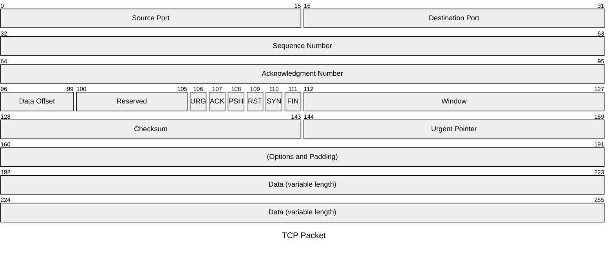
```mermaid
---
title: "TCP Packet"
---
packet
0-15: "Source Port"
16-31: "Destination Port"
32-63: "Sequence Number"
64-95: "Acknowledgment Number"
96-99: "Data Offset"
100-105: "Reserved"
106: "URG"
107: "ACK"
108: "PSH"
109: "RST"
110: "SYN"
111: "FIN"
112-127: "Window"
128-143: "Checksum"
144-159: "Urgent Pointer"
160-191: "(Options and Padding)"
192-255: "Data (variable length)"

```

## 15 架构图

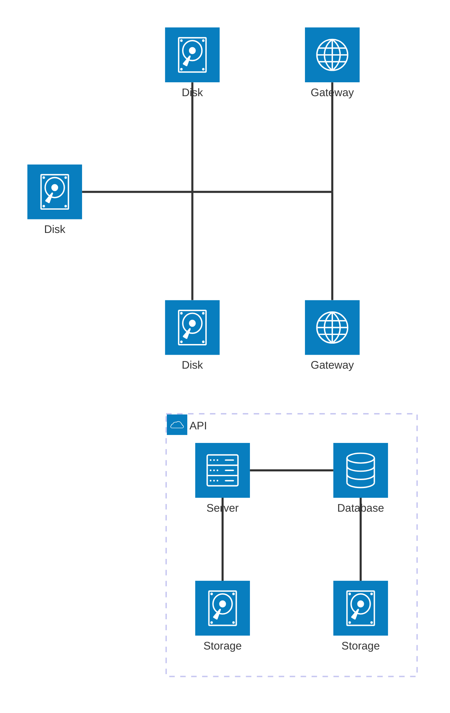
```mermaid
architecture-beta
    group api(cloud)[API]

    service db(database)[Database] in api
    service disk1(disk)[Storage] in api
    service disk2(disk)[Storage] in api
    service server(server)[Server] in api

    db:L -- R:server
    disk1:T -- B:server
    disk2:T -- B:db


    service left_disk(disk)[Disk]
    service top_disk(disk)[Disk]
    service bottom_disk(disk)[Disk]
    service top_gateway(internet)[Gateway]
    service bottom_gateway(internet)[Gateway]
    junction junctionCenter
    junction junctionRight

    left_disk:R -- L:junctionCenter
    top_disk:B -- T:junctionCenter
    bottom_disk:T -- B:junctionCenter
    junctionCenter:R -- L:junctionRight
    top_gateway:B -- T:junctionRight
    bottom_gateway:T -- B:junctionRight

```

## 16 思维导图

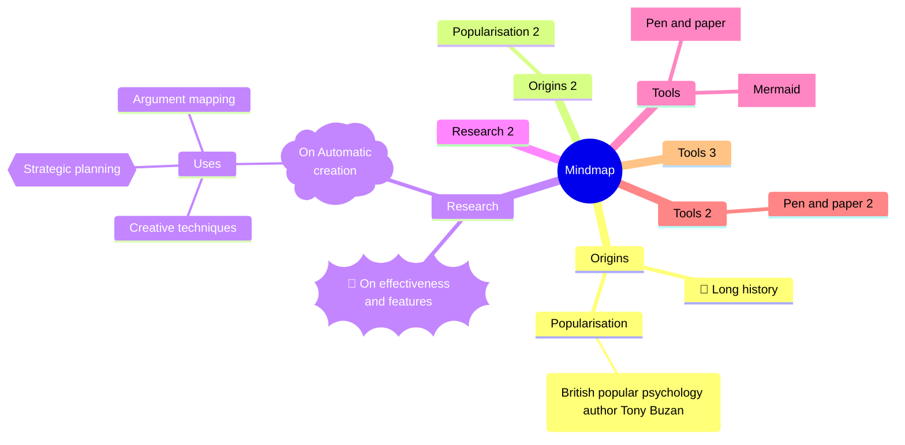
```mermaid
mindmap
  root((Mindmap))
    Origins
      📓 Long history
      Popularisation
        (British popular psychology author Tony Buzan)
    Origins 2
      Popularisation 2
    Research
      ))🍺 On effectiveness<br>and features((
      )On Automatic<br>creation(
        Uses
            Creative techniques
            {{Strategic planning}}
            Argument mapping
    Research 2
    Tools
      [Pen and paper]
      [Mermaid]
    Tools 2
      Pen and paper 2
    Tools 3
```

## 17 Gitgraph 图

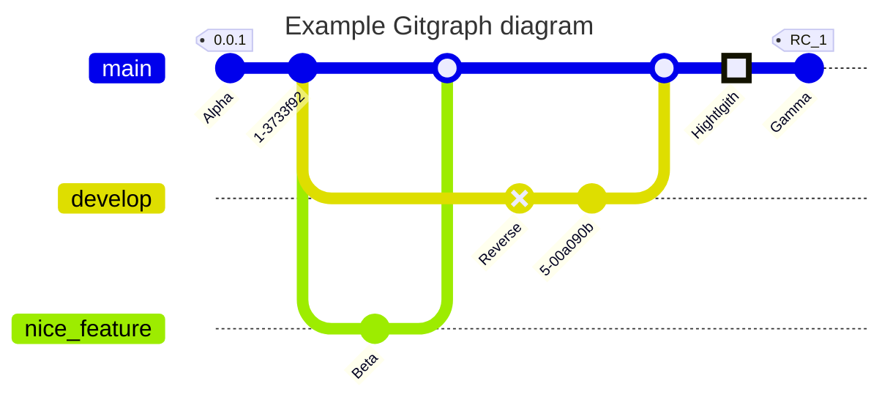
```mermaid
---
title: Example Gitgraph diagram
---
gitGraph
  commit id: "Alpha" tag: "0.0.1"

  commit
  branch develop
    branch nice_feature
    checkout nice_feature
    commit id: "Beta"
    checkout main
    merge nice_feature
  checkout develop

  commit id: "Reverse" type: REVERSE
  commit

  checkout main
  merge develop
  commit id: "Hightlgith" type: HIGHLIGHT

  commit id: "Gamma" tag: "RC_1"

```

## 18 Gitgraph 图

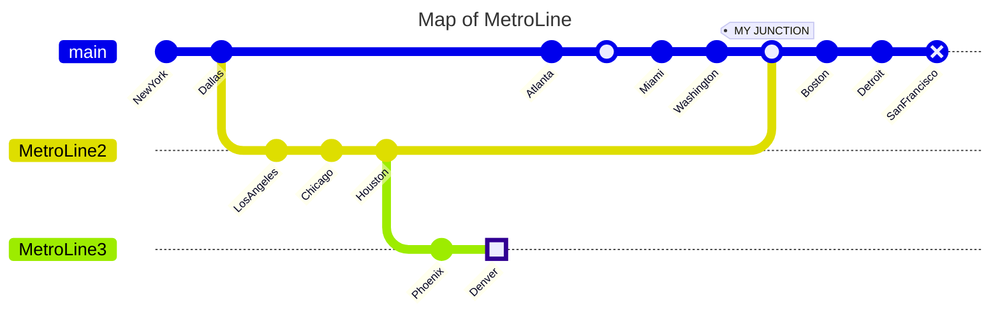
```mermaid
---
title: Map of MetroLine
---
%%{init: {'mainBranchName': 'MetroLine1'}} }%%
gitGraph
  commit id:"NewYork"
  commit id:"Dallas"
  branch MetroLine2
  commit id:"LosAngeles"
  commit id:"Chicago"
  commit id:"Houston"
  branch MetroLine3
  commit id:"Phoenix"
  commit type: HIGHLIGHT id:"Denver"
  commit id:"Boston"
  checkout main
  commit id:"Atlanta"
  merge MetroLine3
  commit id:"Miami"
  commit id:"Washington"
  merge MetroLine2 tag:"MY JUNCTION"
  commit id:"Boston"
  commit id:"Detroit"
  commit type:REVERSE id:"SanFrancisco"
```

## 19 Gitgraph 图

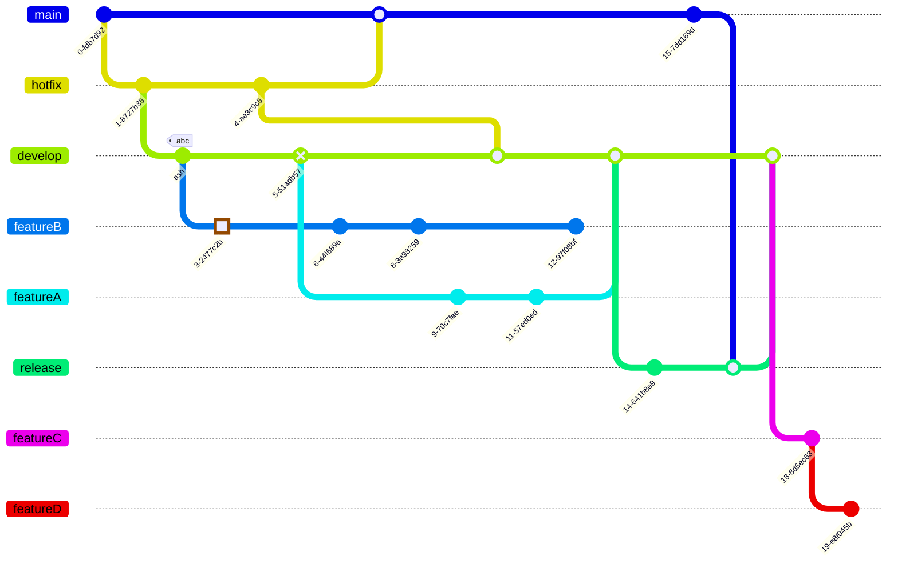
```mermaid
  gitGraph
    commit
    branch hotfix
    checkout hotfix
    commit
    branch develop
    checkout develop
    commit id:"ash" tag:"abc"
    branch featureB
    checkout featureB
    commit type:HIGHLIGHT
    checkout main
    checkout hotfix
    commit type:NORMAL
    checkout develop
    commit type:REVERSE
    checkout featureB
    commit
    checkout main
    merge hotfix
    checkout featureB
    commit
    checkout develop
    branch featureA
    commit
    checkout develop
    merge hotfix
    checkout featureA
    commit
    checkout featureB
    commit
    checkout develop
    merge featureA
    branch release
    checkout release
    commit
    checkout main
    commit
    checkout release
    merge main
    checkout develop
    merge release
    branch featureC
    commit
    branch featureD
    commit

```

## 20 桑基图

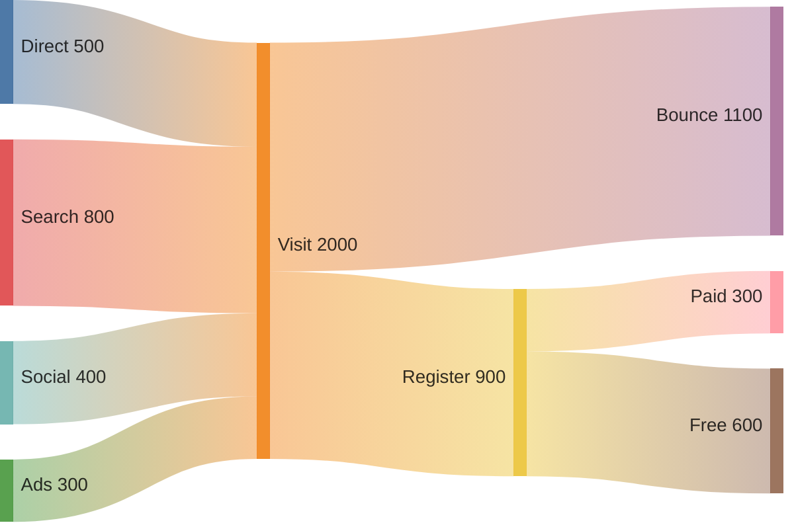
```mermaid
sankey

Direct, Visit, 500
Search, Visit, 800
Social, Visit, 400
Ads, Visit, 300

Visit, Register, 900
Visit, Bounce, 1100

Register, Paid, 300
Register, Free, 600
```

## 21 桑基图

```mermaid
sankey

Total Sales, Shampoo, 500
Total Sales, Detergent, 300
Total Sales, Skincare, 200

Shampoo, Online, 200
Shampoo, Offline, 300

Detergent, Online, 100
Detergent, Offline, 200

Skincare, Online, 150
Skincare, Offline, 50
```

## 22 时间线

```mermaid
timeline
    title History of Social Media Platform
    2002 : LinkedIn
    2004 : Facebook
         : Google
    2005 : Youtube
    2006 : Twitter
    2023 : GPT-3.5
         : GPT-4
```

## 23 时间线

```mermaid
timeline
    title Timeline of Industrial Revolution
    section 17th-20th century
        Industry 1.0 : Machinery, Water power, Steam <br>power
        Industry 2.0 : Electricity, Internal combustion engine, Mass production
        Industry 3.0 : Electronics, Computers, Automation
    section 21st century
        Industry 4.0 : Internet, Robotics, Internet of Things
        Industry 5.0 : Artificial intelligence, Big data,3D printing
```

## 24 时间线

```mermaid
timeline
    STEP 01 : Action 1.1
        : Action 1.2
    STEP 02 : Action 2.1
         : Action 2.2
         : Action 2.3
    STEP 03 : Action 3.1
```

## 25 XY 图

```mermaid
xychart
    title "Sales Revenue"
    x-axis [jan, feb, mar, apr, may, jun, jul, aug, sep, oct, nov, dec]
    y-axis "Revenue (in $)" 4000 --> 11000
    bar [5000, 6000, 7500, 8200, 9500, 10500, 11000, 10200, 9200, 8500, 7000, 6000]
    line [5000, 6000, 7500, 8200, 9500, 10500, 11000, 10200, 9200, 8500, 7000, 6000]
```

## 26 饼图

```mermaid
pie title Q3 2019 中国线上智能手机市场主要品牌市场份额
"华为" : 26
"荣耀" : 20
"小米" : 14
"VIVO" : 10
"Apple" : 9
"OPPO" : 5
"其他" : 16
```

## 27 雷达图

```mermaid
---
title: "Grades"
---
radar-beta
  axis m["Math"], s["Science"], e["English"]
  axis h["History"], g["Geography"], a["Art"]
  curve a["Alice"]{85, 90, 80, 70, 75, 90}
  curve b["Bob"]{70, 75, 85, 80, 90, 85}

  max 100
  min 0

```

## 28 树状图

```mermaid
treemap-beta
"Products"
    "Electronics"
        "Phones": 50
        "Computers": 30
        "Accessories": 20
    "Clothing"
        "Men's": 40
        "Women's": 40

```

## 29 看板图

```mermaid
---
config:
  kanban:
    ticketBaseUrl: 'https://mermaidchart.atlassian.net/browse/#TICKET#'
---
kanban
  Todo
    [Create Documentation]
    docs[Create Blog about the new diagram]
  [In progress]
    id6[Create renderer so that it works in all cases. We also add som extra text here for testing purposes. And some more just for the extra flare.]
  id9[Ready for deploy]
    id8[Design grammar]@{ assigned: 'knsv' }
  id10[Ready for test]
    id4[Create parsing tests]@{ ticket: MC-2038, assigned: 'K.Sveidqvist', priority: 'High' }
    id66[last item]@{ priority: 'Very Low', assigned: 'knsv' }
  id11[Done]
    id5[define getData]
    id2[Title of diagram is more than 100 chars when user duplicates diagram with 100 char]@{ ticket: MC-2036, priority: 'Very High'}
    id3[Update DB function]@{ ticket: MC-2037, assigned: knsv, priority: 'High' }

  id12[Can't reproduce]
    id3[Weird flickering in Firefox]

```

## 30 甘特图

```mermaid
gantt
dateFormat  MM-DD
title 这里显示甘特图标题
%% 排除的日期：monday...saturday, sunday, weekends
excludes weekends

section 区块A
已完成的普通任务	:done, des1, 04-01, 04-03
执行中的普通任务	:active, des2, 04-02, 3d
未来的任务				:des3, after des2, 2d
未来的任务2			:des4, after des3, 2d

section 区块B
已完成的关键路径任务		:crit, done, 04-06, 24h
已完成的关键路径任务2		:crit, done, after des1, 2d
里程碑								:milestone, after des2, 0d

section 区块C
执行中的关键路径任务		:crit, active, 3d
未来的关键路径任务			:crit, 2d
```

<!-- vlook-public-charts:end -->

# The End
